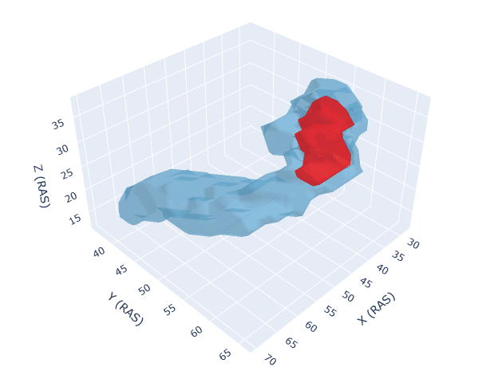

---

# 3D 의료 영상 분석 프로젝트: 췌장암 및 간암 분할/분류



## 1. 프로젝트 개요

본 프로젝트는 3D CT 의료 영상을 딥러닝 모델을 사용하여 분석하는 파이프라인을 제공합니다. 주요 목표는 다음과 같습니다.

* **췌장 분할 (Segmentation):** U-Net 아키텍처를 사용하여 CT 영상에서 췌장 영역을 분할합니다.
* **췌장암 분류 (Classification):** 3D CNN 모델을 사용하여 췌장 CT 영상이 암을 포함하는지 여부를 분류합니다.
* **간암 분류 (Classification):** 동일한 3D CNN 아키텍처를 사용하여 간 CT 영상의 암 여부를 분류합니다.

프로젝트는 데이터 전처리, 모델 학습, 평가, 결과 시각화 및 실제 샘플 예측에 이르는 전체 과정을 포함하며, PyTorch와 MONAI 라이브러리를 기반으로 구현되었습니다.

## 2. 주요 기능

* **모듈화된 코드:** U-Net 분할 모델과 3D CNN 분류 모델이 각각의 독립적인 Python 스크립트(`Unet.py`, `3DCNN.py`)로 구현되어 있습니다.
* **데이터 증강:** MONAI에서 제공하는 다양한 3D 데이터 증강 기법(회전, 반전, 강도 조절 등)을 적용하여 모델의 일반화 성능을 향상시켰습니다.
* **자동화된 파이프라인:** 데이터 압축 해제부터 전처리, 학습, 평가까지의 과정이 스크립트 내에서 순차적으로 실행됩니다.
* **학습 과정 로깅 및 시각화:** 학습 및 검증 손실, 그리고 각 작업에 맞는 평가지표(Dice, IoU, AUC, Accuracy)를 CSV 파일로 기록하고, 이를 Matplotlib을 통해 시각화합니다.
* **체크포인트 저장 및 재학습:** 학습 중 주기적으로 최신 모델을 저장하고, 검증 성능이 가장 좋은 모델을 별도로 저장합니다. 이를 통해 학습을 중단했다가 이어서 진행할 수 있습니다.
* **3-Way 데이터 분할:** 데이터를 학습(Train), 검증(Validation), 테스트(Test) 세트로 분할하여 모델 성능을 보다 객관적으로 평가합니다.

## 3. 프로젝트 구조

```
pancreatic-cancer-AI-3DCNN-Unet/
├── pancreas_project/                    # 췌장 분할 프로젝트 폴더
│   ├── Unet.py                          # 췌장 분할 U-Net 모델 학습/평가 스크립트
│   └── outputs/                         # 분할 모델 결과물 저장 폴더
│       └── ... (로그, 체크포인트 등)
├── pancreas_classification_project/     # 췌장암 분류 프로젝트 폴더
│   ├── 3DCNN.py                         # 췌장암 분류 3D CNN 모델 학습/평가 스크립트
│   └── outputs_classification/          # 분류 모델 결과물 저장 폴더
│       └── ... (로그, 체크포인트 등)
└── Liver_classification_project/        # 간암 분류 프로젝트 폴더
    ├── 3DCNN.py                         # 간암 분류 3D CNN 모델 학습/평가 스크립트
    └── outputs_classification/          # 분류 모델 결과물 저장 폴더
        └── ... (로그, 체크포인트, 최종 결과 등)
```

## 4. 설치 및 환경 설정

### 4.1. 요구사항

* Python 3.8 이상
* PyTorch
* MONAI
* `pip install -r requirements.txt` 명령어를 사용하여 필요한 라이브러리를 설치할 수 있습니다. (필요시 `requirements.txt` 파일 생성)

```
# requirements.txt 예시
torch
monai
numpy
pandas
matplotlib
tqdm
nibabel
scikit-learn
torchinfo
```

### 4.2. 데이터 준비

1.  **데이터 다운로드:**
    * 췌장암 데이터: [Medical Segmentation Decathlon - Task07_Pancreas](http://medicaldecathlon.com/)
    * 간암 데이터: [Medical Segmentation Decathlon - Task03_Liver](http://medicaldecathlon.com/)
    * 정상 데이터셋은 별도로 준비해야 합니다.

2.  **폴더 구성:**
    * `pancreatic-cancer-AI-3DCNN-Unet` 폴더 내에 각 스크립트에서 요구하는 경로에 맞게 데이터를 위치시킵니다.
    * 예를 들어 `간암/3DCNN.py` 스크립트의 경우, `C:/Users/21/Desktop/간암/` 경로에 `Task03_Liver.tar`와 `normal_Liver.zip` 파일을 위치시켜야 합니다.

    ```python
    # 예시: 간암/3DCNN.py의 경로 설정 부분
    DRIVE_BASE_PATH = 'C:/Users/21/Desktop/간암'
    TAR_CANCER_PATH = os.path.join(DRIVE_BASE_PATH, 'Task03_Liver.tar')
    ZIP_NORMAL_PATH = os.path.join(DRIVE_BASE_PATH, 'normal_Liver.zip')
    ```

## 5. 사용법

### 5.1. 췌장 분할 (U-Net)

1.  `pancreatic-cancer-AI-3DCNN-Unet/Unet.py` 파일의 `DRIVE_BASE_PATH`를 실제 데이터 위치에 맞게 수정합니다.
2.  필요에 따라 배치 사이즈, 에포크 등 하이퍼파라미터를 조정합니다.
3.  터미널에서 다음 명령어를 실행합니다.
    ```bash
    python Unet.py
    ```

### 5.2. 췌장암/간암 분류 (3D CNN)

1.  `pancreatic-cancer-AI-3DCNN-Unet/3DCNN.py` (췌장암) 또는 `pancreatic-cancer-AI-3DCNN-Unet/간암/3DCNN.py` (간암) 파일의 `DRIVE_BASE_PATH`를 실제 데이터 위치에 맞게 수정합니다.
2.  필요에 따라 하이퍼파라미터를 조정합니다.
3.  터미널에서 해당 스크립트를 실행합니다.
    ```bash
    # 췌장암 분류
    python 3DCNN.py

    # 간암 분류
    python 간암/3DCNN.py
    ```

## 6. 학습 결과

### 6.1. 췌장 분할 (U-Net)

U-Net 모델은 100 에포크 동안 학습되었으며, 검증 세트에서 Dice 점수와 IoU를 기준으로 성능을 평가했습니다.

* **학습 로그 (20250404-171345):**
    * 최종 에포크(99)에서 검증 Dice 점수는 약 0.588, IoU는 약 0.515를 기록했습니다.
    * 학습 과정에서 Dice 점수가 꾸준히 상승하는 경향을 보였습니다.

* **학습 로그 (20250407-114211):**
    * 8 에포크 학습 후 검증 Dice 점수는 약 0.458을 기록했습니다.

### 6.2. 췌장암 분류 (3D CNN)

3D CNN 분류 모델은 검증 세트에서 AUC(Area Under the ROC Curve)와 정확도를 기준으로 평가되었습니다.

* **학습 로그 (20250407-111555, 20250407-103406):**
    * 10 에포크 학습 후, 검증 세트에서 AUC 1.0, 정확도 1.0을 달성했습니다. 이는 데이터셋이 비교적 작거나 분할이 쉬운 경우일 수 있습니다.

### 6.3. 간암 분류 (3D CNN)

간암 분류 모델은 50 에포크 동안 학습되었으며, 최종적으로 독립적인 테스트 세트에서 성능을 평가했습니다.

* **학습 로그 (20250407-153354):**
    * 학습 과정에서 검증 AUC는 꾸준히 증가하여 35번째 에포크에서 0.853으로 최고점을 기록했습니다.
    * 최종 모델은 36번째 에포크에서 저장되었습니다.

* **최종 테스트 결과:**
    * **테스트 세트 AUC: 0.9350**
    * **테스트 세트 정확도: 0.7500**
    * 테스트 세트 손실: 0.5109

이 결과는 모델이 학습되지 않은 데이터에 대해서도 높은 분류 성능(AUC 기준)을 보임을 의미합니다.

## 7. 향후 개선 방향

* **더 많은 데이터 활용:** 모델의 일반화 성능을 높이기 위해 더 크고 다양한 데이터셋을 사용하여 학습을 진행할 수 있습니다.
* **하이퍼파라미터 최적화:** 학습률(Learning Rate), 배치 사이즈(Batch Size), 모델 구조 등을 조정하여 성능을 추가적으로 개선할 수 있습니다.
* **고급 모델 아키텍처 도입:** Transformer 기반 모델 등 최신 아키텍처를 도입하여 성능 향상을 기대할 수 있습니다.
* **앙상블 기법:** 여러 모델의 예측 결과를 결합하여 보다 안정적이고 높은 성능을 얻을 수 있습니다.

## 8. 참고 기술

본 프로젝트는 다음의 주요 라이브러리 및 프레임워크를 기반으로 구축되었습니다.

* **Python:** 프로젝트의 주요 프로그래밍 언어입니다.
* **PyTorch:** 핵심 딥러닝 프레임워크로, 신경망 모델(3D CNN, U-Net)을 구축하고 학습시키는 데 사용되었습니다.
* **MONAI (Medical Open Network for AI):** 의료 영상 분석을 위한 PyTorch 기반 프레임워크입니다. 데이터 로딩, 3D 데이터 증강, 전처리 및 모델 평가에 핵심적인 역할을 수행했습니다.
* **Scikit-learn:** 모델의 성능 평가 지표(정확도, AUC 점수)를 계산하는 데 사용되었습니다.
* **NiBabel:** NIfTI (.nii, .nii.gz) 형식의 의료 영상 파일을 불러오고 처리하기 위해 MONAI 내부적으로 사용되었습니다.
* **Pandas & NumPy:** 데이터 구조를 다루고, 특히 학습 로그(CSV)를 처리하며, 수치 연산을 위해 사용되었습니다.
* **Matplotlib:** 학습 과정(손실, 평가지표)을 그래프로 시각화하고, 예측 결과를 이미지로 표시하는 데 사용되었습니다.
* **Tqdm:** 데이터 처리 및 모델 학습 과정의 진행 상황을 시각적으로 보여주는 데 사용되었습니다.
* **torchinfo:** 모델의 구조와 파라미터 수를 요약하여 보여주는 데 사용되었습니다.